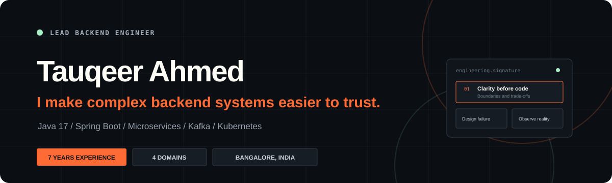
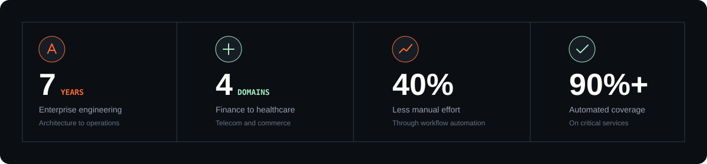
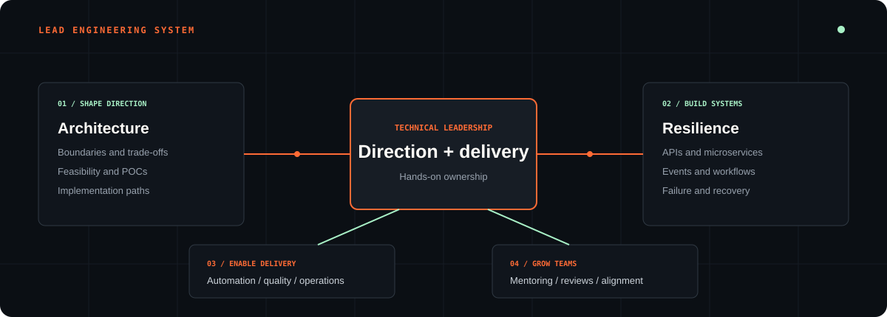
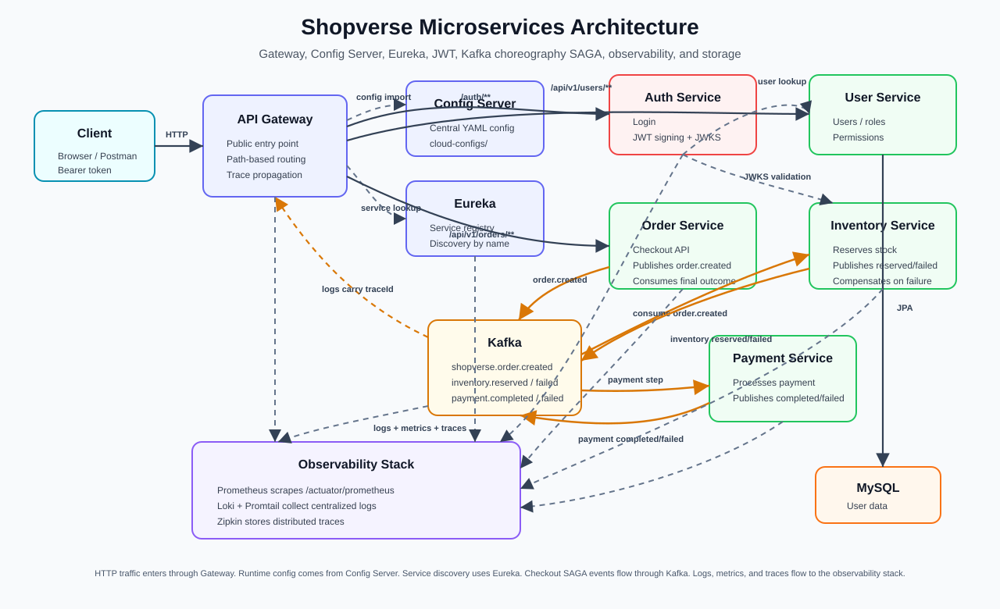

<div align="center">
  
</div>

<div align="center">
  <a href="https://taukhir.github.io/portfolio/">
    
  </a>
  <a href="https://github.com/taukhir/shopverse">
    
  </a>
  <a href="https://github.com/taukhir/shopverse/tree/master/shopverse-web">
    
  </a>
  <a href="https://www.linkedin.com/in/tauqeer-ahmed-java">
    
  </a>
  <a href="mailto:ahmedtaukhir@gmail.com">
    
  </a>
</div>

## Staff / Lead Backend Engineer

I am **Tauqeer Ahmed**, also discoverable online as **Taukhir Ahmed** and
[`@taukhir`](https://github.com/taukhir). I build backend platforms that remain
reliable as their traffic, teams, and business complexity grow.

My work combines hands-on engineering with lead-level ownership: system
boundaries, production APIs, event-driven workflows, platform modernization,
delivery confidence, observability, mentoring, and architecture decisions.

```text
ROLE        Staff / Lead Backend Engineer
FOCUS       Distributed systems | Platform engineering | Solution architecture
STACK       Java 17 | Spring Boot | Kafka | Angular | Kubernetes | AWS
LEADERSHIP  Technical direction | Reviews | Mentoring | Delivery ownership
LOCATION    Bangalore, India | Open to GCC relocation
```

## Recruiter Quick Scan

| Signal | Details |
| --- | --- |
| **Target roles** | Staff Backend Engineer, Lead Backend Engineer, Platform Engineer, Solution Architect |
| **Strongest proof** | [ShopVerse](https://github.com/taukhir/shopverse): Java/Spring microservices, Kafka SAGA, JWT/JWKS, observability, Docker, CI, ADRs, and an Angular frontend |
| **Core stack** | Java 17/21, Spring Boot, Spring Cloud, Kafka, Angular, TypeScript, MySQL, Docker, Kubernetes, AWS |
| **Leadership scope** | Architecture reviews, technical mentoring, stakeholder alignment, delivery ownership, production readiness |

## Current Focus

| Now | What I am working on |
| --- | --- |
| **Role** | Staff / Lead Engineer focused on backend platforms, architecture, and delivery ownership |
| **Current work** | Enterprise POCs, scalable Spring Boot services, workflow automation, and implementation-ready architecture |
| **Engineering direction** | Distributed systems, event-driven workflows, platform reliability, and observability |
| **Collaboration** | Architecture reviews, technical mentoring, stakeholder alignment, and code quality |

## Best Proof of Work

| Proof | Why it matters |
| --- | --- |
| [**ShopVerse**](https://github.com/taukhir/shopverse) | Microservices platform showing gateway, service discovery, config, JWT/JWKS, Kafka SAGA, outbox, observability, Docker, and CI |
| [**ShopVerse Web**](https://github.com/taukhir/shopverse/tree/master/shopverse-web) | Angular commerce client connecting storefront, auth, cart, checkout, orders, account, and admin operations to the backend APIs |
| [Architecture decisions](https://github.com/taukhir/shopverse/tree/master/docs/adr) | Short ADRs explaining key backend trade-offs rather than only showing diagrams |
| [Portfolio](https://taukhir.github.io/portfolio/) | Recruiter-friendly story of experience, leadership scope, architecture work, and contact details |
| [ShopVerse architecture diagram](./assets/shopverse-architecture-flow.svg) | One-page visual of service boundaries, event flow, security, data stores, and observability |

## Engineering Impact

<div align="center">
  
</div>

| Impact area | What I delivered |
| --- | --- |
| **Architecture** | Decomposed a banking reporting monolith into **8+ Spring Boot microservices** |
| **Automation** | Reduced recurring manual operational effort by more than **40%** |
| **Scale** | Built Kafka-backed telecom billing services processing **10M+ monthly transactions** |
| **Quality** | Reached **90%+ automated test coverage** on critical healthcare services |
| **Security** | Helped drive an enterprise Kubernetes environment to **zero critical CVEs** |
| **Interoperability** | Built HL7-to-FHIR and Kafka-based clinical data-processing pipelines |
| **Leadership** | Lead feasibility studies, architecture reviews, technical delivery, and mentoring |

## Lead Engineering Capabilities

<div align="center">
  
</div>

| Shape direction | Build resilient systems | Enable delivery | Grow teams |
| --- | --- | --- | --- |
| Architecture and feasibility | APIs and microservices | CI/CD and automation | Mentoring and reviews |
| Boundaries and trade-offs | Events and failure handling | Observability and security | Stakeholder alignment |
| POCs and implementation paths | Data and workflows | Incidents and operations | Technical ownership |

## Technical Toolkit

**Backend and architecture**


**Frontend and product delivery**


**Events, workflow, and data**


**Cloud, platform, and delivery**


**Quality and leadership**


## ShopVerse: Architecture in Practice

[**ShopVerse**](https://github.com/taukhir/shopverse) is a production-minded
Spring Boot microservices reference platform. It demonstrates the decisions
behind a resilient commerce backend rather than only presenting disconnected
services.

<div align="center">
  <a href="https://github.com/taukhir/shopverse">
    
  </a>
</div>

| Engineering question | ShopVerse approach |
| --- | --- |
| How do services communicate safely? | REST for direct operations and Kafka for asynchronous workflows |
| What happens when checkout partially fails? | Choreography SAGA with explicit failure and compensation paths |
| How is authentication shared safely? | Asymmetric JWT signing and JWKS validation |
| How does the system become usable end to end? | Angular storefront and admin UI covering auth, catalog, cart, checkout, orders, account, inventory, payments, users, and recovery |
| How is production behavior diagnosed? | Prometheus, Loki, Grafana, Zipkin, and propagated trace IDs |
| How is delivery made repeatable? | Docker Compose, Kubernetes, GitHub Actions, Jenkins, and centralized configuration |
| Where are trade-offs documented? | ADRs for gateway/discovery/config, Kafka SAGA, JWT/JWKS, and observability |

<p align="center">
  <a href="https://github.com/taukhir/shopverse">
    
  </a>
  <a href="https://github.com/taukhir/shopverse#readme">
    
  </a>
  <a href="https://github.com/taukhir/shopverse/tree/master/shopverse-web">
    
  </a>
  <a href="https://github.com/taukhir/shopverse/tree/master/docs/adr">
    
  </a>
</p>

## ShopVerse Web: Angular Frontend

[**ShopVerse Web**](https://github.com/taukhir/shopverse/tree/master/shopverse-web)
is the Angular client for the ShopVerse platform. It shows that the architecture
is not only a backend diagram: the system has user-facing flows, protected
routes, session handling, checkout integration, and operations screens.

| Area | What it demonstrates |
| --- | --- |
| **Customer journey** | Storefront, catalog, cart, checkout, order history, order detail, and account pages |
| **Security integration** | Login, registration, JWT session storage, auth guards, and an HTTP auth interceptor |
| **Backend integration** | REST calls into ShopVerse APIs for users, orders, inventory, payment, and recovery data |
| **Operations UI** | Admin views for orders, inventory, payments, failed-event recovery, and user management |
| **Frontend stack** | Angular 22, TypeScript, RxJS, Angular Router, forms, responsive SCSS, and API-driven state |

## Engineering Principles

| Principle | In practice |
| --- | --- |
| **Clarity before code** | Make rules, boundaries, constraints, and trade-offs reviewable |
| **Failure is a design input** | Plan retries, idempotency, compensation, and recovery paths |
| **Observability is a feature** | Ship metrics, logs, traces, and actionable health signals |
| **Automation creates leverage** | Remove repetitive work from testing, delivery, and operations |
| **Leadership multiplies context** | Help teams understand why a decision works, not only what to build |

## Career Highlights

- **Nagarro:** lead enterprise POCs, architecture evaluation, and delivery from
  discovery through stakeholder validation
- **HCLTech:** strengthened Kubernetes reliability, observability, security,
  incident response, and production readiness
- **Morgan Stanley:** decomposed a legacy reporting platform into 8+ Spring Boot
  microservices, upgraded Angular 7 to 17 applications, and reduced manual
  reporting effort by 40%+
- **Optum:** delivered FHIR, HL7, Kafka, and Spring Boot healthcare data flows
  with 90%+ test coverage and 40% faster issue detection through monitoring
- **Tecnotree:** built resilient event-driven telecom billing workflows handling
  10M+ monthly transactions and automated 25+ Camunda/BPMN workflows

## Explore My Work

| Destination | What you will find |
| --- | --- |
| [Portfolio](https://taukhir.github.io/portfolio/) | Experience, capabilities, architecture, engineering approach, and contact details |
| [ShopVerse](https://github.com/taukhir/shopverse) | Microservices architecture, source code, deployment assets, and engineering documentation |
| [ShopVerse Web](https://github.com/taukhir/shopverse/tree/master/shopverse-web) | Angular storefront, checkout, account, order tracking, and admin operations UI |
| [Architecture diagram](./assets/shopverse-architecture-flow.svg) | Gateway, config, service discovery, JWT, Kafka SAGA, data, and observability flow |
| [Repositories](https://github.com/taukhir?tab=repositories) | Public projects, reference implementations, and experiments |
| [GitHub activity](https://github.com/taukhir?tab=overview) | Contributions, commits, pull requests, and repository activity |
| [Resume](https://taukhir.github.io/portfolio/assets/Tauqeer-Ahmed-Resume.pdf) | Detailed professional experience and technical background |

## Repository Portfolio

| Repository | Role in my profile | What it proves |
| --- | --- | --- |
| [ShopVerse](https://github.com/taukhir/shopverse) | Primary architecture proof | Distributed checkout, Kafka choreography, outbox, security, observability, CI, Docker, ADRs, and Angular client integration |
| [ShopVerse Web](https://github.com/taukhir/shopverse/tree/master/shopverse-web) | Frontend/product proof | Angular storefront, protected routes, cart, checkout, order tracking, account, and admin operations screens |
| [Portfolio](https://github.com/taukhir/portfolio) | Hiring narrative and frontend polish | Responsive UI, accessibility, SEO, GitHub Pages deployment, and technical storytelling |
| [smart-order-analytics-reporting](https://github.com/taukhir/smart-order-analytics-reporting) | Java/backend supporting project | Backend reporting and analytics direction |

## Current Direction

I am interested in **Staff Backend Engineer**, **Lead Backend Engineer**, **Platform Engineering**, and
**Solution Architecture** opportunities where hands-on technical leadership,
distributed systems, and production ownership matter.

<div align="center">
  <a href="mailto:ahmedtaukhir@gmail.com">
    
  </a>
  <a href="https://www.linkedin.com/in/tauqeer-ahmed-java">
    
  </a>
  <a href="https://taukhir.github.io/portfolio/">
    
  </a>
</div>

<br>

<div align="center">
  <strong>Architecture should make change safer, not make the diagram more impressive.</strong>
</div>
