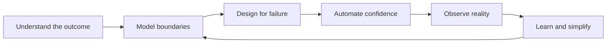

<div align="center">
  
</div>

<div align="center">
  <a href="mailto:ahmedtaukhir@gmail.com">
    
  </a>
  <a href="https://www.linkedin.com/in/tauqeer-ahmed-379803173">
    
  </a>
  <a href="https://github.com/taukhir">
    
  </a>
</div>

## Hello, I am Tauqeer

I am a **Lead Backend Engineer** based in Bangalore, India, with nearly seven
years of experience delivering enterprise software across finance, healthcare,
telecom, and commerce.

I turn complex business workflows into backend systems that are easier to
operate, evolve, and trust. My work spans architecture and implementation:
service boundaries, production APIs, event-driven workflows, platform
modernization, observability, and technical leadership.

```text
tauqeer@engineering:~$ profile

ROLE        Lead Backend Engineer
BUILDS      Reliable services, event-driven platforms, enterprise POCs
STACK       Java 17 | Spring Boot | Kafka | Kubernetes | AWS
LEADS       Architecture reviews | Mentoring | Delivery ownership
EXPLORES    Platform engineering | Distributed systems | Applied AI
LOCATION    Bangalore, India | Open to GCC relocation
```

## Engineering Impact

| 7 years | 40% less effort | 90%+ coverage | 4 domains |
| :---: | :---: | :---: | :---: |
| Enterprise engineering | Through workflow automation | On critical services | Finance, healthcare, telecom, commerce |

## My Engineering Operating System



| Principle | What it means in practice |
| --- | --- |
| **Clarity before code** | Make business rules, boundaries, and trade-offs reviewable |
| **Failure is a design input** | Plan retries, idempotency, compensation, and recovery paths |
| **Observability is a feature** | Ship metrics, logs, traces, and actionable health signals |
| **Automation creates leverage** | Remove repetitive work from testing, delivery, and operations |
| **Leadership multiplies context** | Help teams understand why a decision works, not only what to build |

## ShopVerse: Architecture in Practice

<a href="https://github.com/taukhir/shopverse">
  
</a>

**ShopVerse** is a production-minded Spring Boot microservices reference
platform where I explore the decisions behind a real e-commerce backend, not
just a collection of disconnected services.

### The engineering questions it answers

| Challenge | Approach |
| --- | --- |
| How should services communicate safely? | REST for direct operations and Kafka for asynchronous workflows |
| What happens when an order partially fails? | Choreography SAGA with explicit failure and compensation paths |
| How is trust shared without sharing secrets? | Asymmetric JWT authentication and JWKS validation |
| How do we understand production behavior? | Prometheus, Loki, Grafana, and Zipkin observability |
| How does the platform remain repeatable? | Docker Compose, GitHub Actions, Jenkins, and centralized configuration |

<p>
  <a href="https://github.com/taukhir/shopverse">
    
  </a>
</p>

## Tools I Use to Deliver

**Backend and architecture**


**Events and data**


**Cloud and operations**


**Quality and delivery**


## GitHub Activity

<div align="center">
  
  
</div>

<div align="center">
  
</div>

## Career Highlights

- **Nagarro:** lead enterprise POCs, convert ambiguous requirements into
  demonstrable solutions, and guide architecture and delivery decisions
- **HCLTech:** improved Kubernetes platform reliability and resolved critical
  security vulnerabilities across enterprise environments
- **Morgan Stanley:** contributed to investment-management modernization from
  a monolith toward independently deployable microservices
- **Optum:** built HL7-to-FHIR and Kafka-based healthcare data-processing flows
- **Tecnotree:** engineered resilient event-driven services for telecom billing
- **Automation:** reduced recurring manual operational effort by more than 40%

## Beyond the Repository

I enjoy the part of engineering where the answer is not obvious yet: making
trade-offs visible, turning a proof of concept into a production direction, and
leaving both the system and the team easier to evolve.

I am open to **Lead Backend Engineer**, **Platform Engineering**, and
**Solution Architecture** opportunities where hands-on technical leadership
matters.

**Email:** [ahmedtaukhir@gmail.com](mailto:ahmedtaukhir@gmail.com)  
**LinkedIn:** [tauqeer-ahmed-379803173](https://www.linkedin.com/in/tauqeer-ahmed-379803173)  
**GitHub:** [github.com/taukhir](https://github.com/taukhir)

<div align="center">
  <strong>Architecture should make change safer, not make the diagram more impressive.</strong>
</div>
